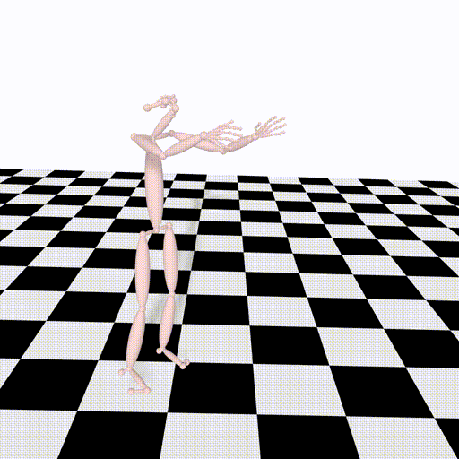
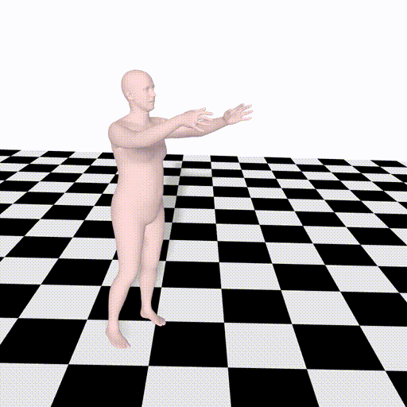

<!--
 * @Date: 2021-01-13 20:32:12
 * @Author: Qing Shuai
 * @LastEditors: Qing Shuai
 * @LastEditTime: 2021-01-25 19:35:14
 * @FilePath: /EasyMocapRelease/Readme.md
-->
# EasyMocap
**EasyMocap** is an open-source toolbox for **markerless human motion capture** from RGB videos.

In this project, we provide the basic code for fitting SMPL[1]/SMPL+H[2]/SMPLX[3] model to capture body+hand+face poses from multiple views.

|Input|:heavy_check_mark: Skeleton|:heavy_check_mark: SMPL|
|----|----|----|
||||

> We plan to intergrate more interesting algorithms, please stay tuned!

1. [Multi-Person from Multiple Views](https://github.com/zju3dv/mvpose)
2. [Mocap from Multiple **Uncalibrated** and **Unsynchronized** Videos](https://arxiv.org/pdf/2008.07931.pdf)
3. [Dense Reconstruction and View Synthesis from **Sparse Views**](https://zju3dv.github.io/neuralbody/)

## Installation
### 1. Download SMPL models
This step is the same as [smplx](https://github.com/vchoutas/smplx#model-loading).

To download the *SMPL* model go to [this](http://smpl.is.tue.mpg.de) (male and female models, version 1.0.0, 10 shape PCs) and [this](http://smplify.is.tue.mpg.de) (gender neutral model) project website and register to get access to the downloads section. 

To download the *SMPL+H* model go to [this project website](http://mano.is.tue.mpg.de) and register to get access to the downloads section. 

To download the *SMPL-X* model go to [this project website](https://smpl-x.is.tue.mpg.de) and register to get access to the downloads section. 

**Place them as following:**
```bash
data
└── smplx
    ├── J_regressor_body25.npy
    ├── J_regressor_body25_smplh.txt
    ├── J_regressor_body25_smplx.txt
    ├── smpl
    │   ├── SMPL_FEMALE.pkl
    │   ├── SMPL_MALE.pkl
    │   └── SMPL_NEUTRAL.pkl
    ├── smplh
    │   ├── MANO_LEFT.pkl
    │   ├── MANO_RIGHT.pkl
    │   ├── SMPLH_FEMALE.pkl
    │   └── SMPLH_MALE.pkl
    └── smplx
        ├── SMPLX_FEMALE.pkl
        ├── SMPLX_MALE.pkl
        └── SMPLX_NEUTRAL.pkl
```

### 2. Requirements
- torch==1.4.0
- torchvision==0.5.0
- opencv-python
- [pyrender](https://pyrender.readthedocs.io/en/latest/install/index.html#python-installation): for visualization
- chumpy: for loading SMPL model
- OpenPose[4]: for 2D pose

Some of python libraries can be found in `requirements.txt`. You can test different version of PyTorch.


## Quick Start
We provide an example multiview dataset[[dropbox](https://www.dropbox.com/s/24mb7r921b1g9a7/zju-ls-feng.zip?dl=0)][[BaiduDisk](https://pan.baidu.com/s/1lvAopzYGCic3nauoQXjbPw)(vg1z)], which has 800 frames from 23 synchronized and calibrated cameras. After downloading the dataset, you can run the following example scripts.
```bash
data=path/to/data
out=path/to/output
# 0. extract the video to images
python3 scripts/preprocess/extract_video.py ${data}
# 1. example for skeleton reconstruction
python3 code/demo_mv1pmf_skel.py ${data} --out ${out} --vis_det --vis_repro --undis --sub_vis 1 7 13 19
# 2.1 example for SMPL reconstruction
python3 code/demo_mv1pmf_smpl.py ${data} --out ${out} --end 300 --vis_smpl --undis --sub_vis 1 7 13 19 --gender male
# 2.2 example for SMPL-X reconstruction
python3 code/demo_mv1pmf_smpl.py ${data} --out ${out} --undis --body bodyhandface --sub_vis 1 7 13 19 --start 400 --model smplx --vis_smpl --gender male
# 3.1 example for rendering SMPLX to ${out}/smpl
python3 code/vis_render.py ${data} --out ${out} --skel ${out}/smpl --model smplx --gender male --undis --start 400 --sub_vis 1
# 3.2 example for rendering skeleton of SMPL to ${out}/smplskel
python3 code/vis_render.py ${data} --out ${out} --skel ${out}/smpl --model smplx --gender male --undis --start 400 --sub_vis 1 --type smplskel --body bodyhandface
```

## Not Quick Start
### 0. Prepare Your Own Dataset
```bash
zju-ls-feng
├── intri.yml
├── extri.yml
└── videos
    ├── 1.mp4
    ├── 2.mp4
    ├── ...
    ├── 8.mp4
    └── 9.mp4
```
The input videos are placed in `videos/`.

Here `intri.yml` and `extri.yml` store the camera intrinsici and extrinsic parameters. For example, if the name of a video is `1.mp4`, then there must exist `K_1`, `dist_1` in `intri.yml`, and `R_1((3, 1), rotation vector of camera)`, `T_1(3, 1)` in `extri.yml`. The file format is following [OpenCV format](https://docs.opencv.org/master/dd/d74/tutorial_file_input_output_with_xml_yml.html).

### 1. Run [OpenPose](https://github.com/CMU-Perceptual-Computing-Lab/openpose)
```bash
data=path/to/data
out=path/to/output
python3 scripts/preprocess/extract_video.py ${data} --openpose <openpose_path> --handface
```
- `--openpose`: specify the openpose path
- `--handface`: detect hands and face keypoints

### 2. Run the code
```bash
# 1. example for skeleton reconstruction
python3 code/demo_mv1pmf_skel.py ${data} --out ${out} --vis_det --vis_repro --undis --sub_vis 1 7 13 19
# 2. example for SMPL reconstruction
python3 code/demo_mv1pmf_smpl.py ${data} --out ${out} --end 300 --vis_smpl --undis --sub_vis 1 7 13 19
```
The input flags:
- `--undis`: use to undistort the images
- `--start, --end`: control the begin and end number of frames.

The output flags:
- `--vis_det`: visualize the detection
- `--vis_repro`: visualize the reprojection
- `--sub_vis`: use to specify the views to visualize. If not set, the code will use all views
- `--vis_smpl`: use to render the SMPL mesh to images.

### 3. Output
The results are saved in `json` format.
```bash
<output_root>
├── keypoints3d
│   ├── 000000.json
│   └── xxxxxx.json
└── smpl
    ├── 000000.jpg
    ├── 000000.json
    └── 000004.json
```
The data in `keypoints3d/000000.json` is a list, each element represents a human body.
```bash
{
    'id': <id>,
    'keypoints3d': [[x0, y0, z0, c0], [x1, y1, z0, c1], ..., [xn, yn, zn, cn]]
}
```

The data in `smpl/000000.json` is also a list, each element represents the SMPL parameters which is slightly different from official model.
```bash
{
    "id": <id>,
    "Rh": <(1, 3)>,
    "Th": <(1, 3)>,
    "poses": <(1, 72/78/87)>,
    "expression": <(1, 10)>,
    "shapes": <(1, 10)>
}
```
We set the first 3 dimensions of `poses` to zero, and add a new parameter `Rh` to represents the global oritentation, the vertices of SMPL model V = RX(theta, beta) + T.

If you use SMPL+H model, the poses contains `22x3+6+6`. We use `6` pca coefficients for each hand. `3(jaw, left eye, right eye)x3` poses of head are added for SMPL-X model.

## Evaluation

In our code, we do not set the best weight parameters, you can adjust these according your data. If you find a set of good weights, feel free to tell me.

We will add more quantitative reports in [doc/evaluation.md](doc/evaluation.md)

## Acknowledgements
Here are the great works this project is built upon:

- SMPL models and layer are from MPII [SMPL-X model](https://github.com/vchoutas/smplx).
- Some functions are borrowed from [SPIN](https://github.com/nkolot/SPIN), [VIBE](https://github.com/mkocabas/VIBE), [SMPLify-X](https://github.com/vchoutas/smplify-x)
- The method for fitting 3D skeleton and SMPL model is similar to [TotalCapture](http://www.cs.cmu.edu/~hanbyulj/totalcapture/), without using point cloud.

We also would like to thank Wenduo Feng who is the performer in the sample data.

## Contact
Please open an issue if you have any questions.

## Citation
This project is a part of our work [iMocap](https://zju3dv.github.io/iMoCap/) and [Neural Body](https://zju3dv.github.io/neuralbody/)

Please consider citing these works if you find this repo is useful for your projects. 

```bibtex
@inproceedings{dong2020motion,
  title={Motion capture from internet videos},
  author={Dong, Junting and Shuai, Qing and Zhang, Yuanqing and Liu, Xian and Zhou, Xiaowei and Bao, Hujun},
  booktitle={European Conference on Computer Vision},
  pages={210--227},
  year={2020},
  organization={Springer}
}

@article{peng2020neural,
  title={Neural Body: Implicit Neural Representations with Structured Latent Codes for Novel View Synthesis of Dynamic Humans},
  author={Peng, Sida and Zhang, Yuanqing and Xu, Yinghao and Wang, Qianqian and Shuai, Qing and Bao, Hujun and Zhou, Xiaowei},
  journal={arXiv preprint arXiv:2012.15838},
  year={2020}
}
```

## Reference
```bash
[1] Loper, Matthew, et al. "SMPL: A skinned multi-person linear model." ACM transactions on graphics (TOG) 34.6 (2015): 1-16.
[2] Romero, Javier, Dimitrios Tzionas, and Michael J. Black. "Embodied hands: Modeling and capturing hands and bodies together." ACM Transactions on Graphics (ToG) 36.6 (2017): 1-17.
[3] Pavlakos, Georgios, et al. "Expressive body capture: 3d hands, face, and body from a single image." Proceedings of the IEEE/CVF Conference on Computer Vision and Pattern Recognition. 2019.
Bogo, Federica, et al. "Keep it SMPL: Automatic estimation of 3D human pose and shape from a single image." European conference on computer vision. Springer, Cham, 2016.
[4] Cao, Z., Hidalgo, G., Simon, T., Wei, S.E., Sheikh, Y.: Openpose: real-time multi-person 2d pose estimation using part affinity fields. arXiv preprint arXiv:1812.08008 (2018)
```
